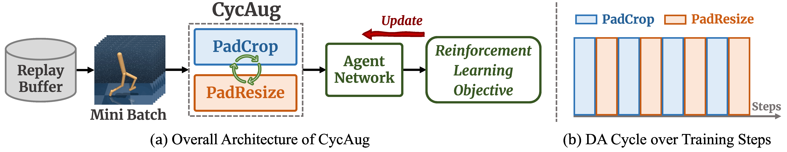

<p align="center">

  <h1 align="center">Cycling Augmentation (CycAug) on Visual RL</h1>
  <h2 align="center"><a href="https://arxiv.org/abs/2305.16379">Learning Better with Less: Effective Augmentation for Sample-Efficient VRL</a></h2>
  <p align="center">
    <a><strong>Guozheng Ma</strong></a>
    ·
    <a><strong>Linrui Zhang</strong></a>
    ·
    <a><strong>Haoyu Wang</strong></a>
    ·
    <a><strong>Lu Li</strong></a>
    ·
    <a><strong>Zilin Wang</strong></a>
  </p>
  <p align="center">
    <a><strong>Zhen Wang</strong></a>
    ·
    <a><strong>Li Shen</strong></a>
    ·
    <a><strong>Xueqian Wang</strong></a>
    ·
    <a><strong>DaCheng Tao</strong></a>
  </p>

</p>

<div align="center">
  
</div>


## 📝 Citation
If this repository is useful to you, please consider citing our paper:
```
@article{ma2023learning,
  title={Learning Better with Less: Effective Augmentation for Sample-Efficient Visual Reinforcement Learning},
  author={Ma, Guozheng and Zhang, Linrui and Wang, Haoyu and Li, Lu and Wang, Zilin and Wang, Zhen and Shen, Li and Wang, Xueqian and Tao, Dacheng},
  journal={arXiv preprint arXiv:2305.16379},
  year={2023}
}
```
